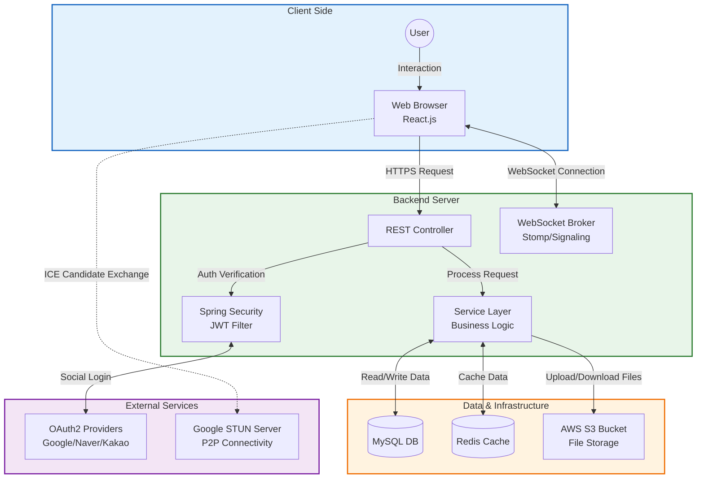

# 🌉 SayBridge

> **"언어의 장벽을 넘어, 세상과 소통하다."**
>
> **WebRTC 기반의 실시간 화상 채팅 & 언어 학습 관리 플랫폼**

 

## 📖 프로젝트 소개 (Project Overview)

**SayBridge**는 단순한 동영상 강의 시청을 넘어, 강사와 학생이 실시간으로 소통하며 언어를 학습할 수 있는 **양방향 에듀테크(Edu-Tech) 플랫폼**입니다.

기존 학습 플랫폼의 일방향적인 소통 문제를 해결하기 위해 **WebRTC 기술을 도입하여 1:N 화상 수업 및 실시간 채팅** 환경을 구축했습니다. 또한, **QueryDSL**을 활용한 정교한 강의 검색, **AWS S3** 기반의 과제 제출 시스템, 그리고 **OAuth2** 소셜 로그인을 통해 사용자의 편의성과 학습 효율을 극대화했습니다.

 

## 🛠 기술 스택 (Tech Stack)

### Frontend
| Tech | Description |
| :--- | :--- |
| **Framework** | React.js (Create-React-App) |
| **Language** | JavaScript (ES6+) |
| **Styling** | Styled-components |
| **Real-time** | SockJS, StompJS, Simple-peer (WebRTC) |
| **State Mgt** | Context API |
| **Network** | Axios |

### Backend
| Tech | Description |
| :--- | :--- |
| **Framework** | Spring Boot 3.x |
| **Language** | Java 17 |
| **Database** | MySQL (Prod), Redis (Cache/Session) |
| **ORM** | Spring Data JPA, QueryDSL |
| **Security** | Spring Security, JWT, OAuth2 (Naver, Kakao, Google) |

### Infra & Tools
| Tech | Description |
| :--- | :--- |
| **Storage** | AWS S3 (Profile & Homework Files) |
| **Build Tool** | Gradle |
| **Server** | Google STUN (WebRTC Connectivity) |

 

## 🏗 시스템 아키텍처 (System Architecture)

1.  **Client:** 사용자 (Web Browser - React)
2.  **Backend:** Spring Boot REST API 서버 및 WebSocket 브로커
3.  **Real-time:** WebRTC(P2P)를 통한 화상 통신 및 STOMP 메시징
4.  **Data Storage:** MySQL(메인 DB), Redis(캐시), AWS S3(파일 저장)
5.  **Authentication:** OAuth2 소셜 로그인 및 JWT 인증 처리

 

## 🌟 핵심 기능 (Key Features)

### 1. 📹 WebRTC 기반 실시간 화상 강의
* **P2P 화상 통신:** `Simple-peer` 라이브러리와 `WebSocket(Stomp)` 시그널링을 통해 강사와 학생 간의 끊김 없는 화상 수업을 구현했습니다.
* **실시간 채팅:** 수업 중 질문이나 피드백을 즉각적으로 주고받을 수 있는 채팅 기능을 제공합니다.

### 2. 📚 QueryDSL 활용 강의 검색 및 필터링
* **동적 쿼리 검색:** 언어(영어, 스페인어 등), 난이도(초/중/고급) 등 복합적인 조건에 맞춰 `QueryDSL`로 최적화된 검색 결과를 제공합니다.
* **수강 관리:** 강사는 학생들의 수강 신청을 승인/거절할 수 있으며, 수강생 목록을 효율적으로 관리할 수 있습니다.

### 3. 📝 과제 제출 및 파일 관리 시스템
* **AWS S3 연동:** `S3Service`를 구축하여 학생들의 과제 파일과 프로필 이미지를 클라우드 스토리지에 안전하게 저장합니다.
* **피드백 루프:** 학생은 과제를 업로드하고, 강사는 제출된 파일을 확인하여 피드백을 제공하는 양방향 학습 구조를 갖췄습니다.

### 4. 🔐 OAuth2 & JWT 통합 보안 인증
* **소셜 로그인:** 네이버, 카카오, 구글 등 다양한 소셜 계정을 통한 간편 로그인을 지원하여 접근성을 높였습니다. (`CustomOAuth2UserService`)
* **무상태 보안:** `JWT` 토큰 기반의 인증 방식을 채택하여 서버의 확장성을 확보하고 보안성을 강화했습니다.

